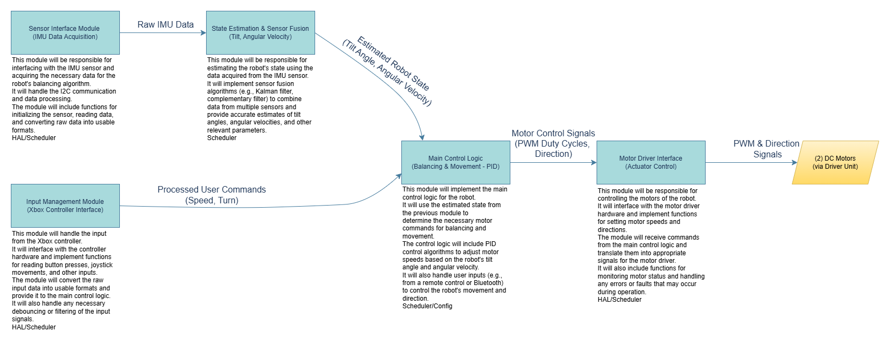

# SELF Balancing Robot

MCU (Microcontroller Unit): ESP-WROOM-32 

IMU (Inertial Measurment Unit): GY-521 

## Design

### Pin Out

[Google Sheet Pin Out Diagram](https://docs.google.com/spreadsheets/d/1lCuJJPs_-ZYu7kVZD1LAmiCTTDlawlaXdf8EDxlrphQ/edit?usp=sharing)

### Software Diagram

### Hardware Diagram
_link// insert here_

